# 禮物小幫手(PG AutoGift)

自動化 Pokémon GO 的「開禮物」與「送禮物」——不用每天手動點幾十次好友列表。

這裡**只放下載用的 APK 與操作說明**。這是個人小工具,寫給少數朋友互相測試用,不是正式產品,沒有客服,能不能用、好不好用都看緣分。

> 本說明對應版本:**v0.6**——**大部分手機第一次按開始會自動校準畫面位置,不用再逐畫面「學習」**;修正 v0.5 一裝就閃退的問題;首頁標題下顯示版本號;「全部做完」的開禮→送禮銜接已實機驗證。
>
> ⚠️ **用過 v0.5 的人請務必更新**——v0.5 有一個一按功能就閃退的錯誤。

**📱 用手機掃描這個 QR code,直接開啟本頁:**

---

## ⚠️ 使用前必看

- **這工具違反 Pokémon GO(Niantic)的服務條款。** 使用視覺辨識 + 系統手勢模擬全自動操作送禮/開禮,屬於官方明令禁止的自動化行為。
- Niantic 對這類行為採**三振制度**:警告 → 停權 7 天 → 停權 30 天 → 永久停權。伺服器端偵測的是**長期、規律、100% 完成**的操作模式,不是單次動作。
- **風險完全由使用者自己承擔。** 你的帳號、你的決定。不確定就先不要用,或只在小號上試。
- 本工具**不**做 GPS 偽造、不修改或反編譯官方 APK、不 root、不繞過任何偵測機制——純粹是螢幕截圖辨識 + Android 內建的「協助工具」模擬點擊,跟你自己手動點沒有技術上的差別,只是換電腦手指幫你點。這是為了把風險壓在「重複操作」本身,不疊加其他更嚴重的違規。

如果看到這裡還想用,那就繼續往下看。

---

## 這工具做什麼

- **只開禮物**:自動排序好友列表(有禮物的排前面)→ 從第一位開始逐一開禮物 → 遇到沒禮物的好友就自動停下。
- **只送禮物**:同樣邏輯,自動排序 → 逐一送禮物 → 送完了自動停下。
- **全部做完**:上面兩個接起來一次跑完(先開禮,再送禮)。
- 過程中隨時可以按懸浮鈕上的紅色按鈕**立刻停止**。
- 每輪處理的好友數量、動畫等待速度(標準/保守/最保守)都可以在「設定」頁調整。

**它不會**:自動移動角色位置、抓寶可夢、打道館、加好友——只做開禮物跟送禮物這兩件事。

## 技術原理(簡短版)

App 用 Android 官方的 `MediaProjection` 看畫面(截圖辨識現在停在哪個畫面)、用官方的「協助工具」API 模擬點擊與滑動。不讀取、不修改 Pokémon GO 的任何資料,單純是「看畫面 → 決定點哪裡 → 點下去」,跟你自己操作走的是同一條路。

## App 長這樣

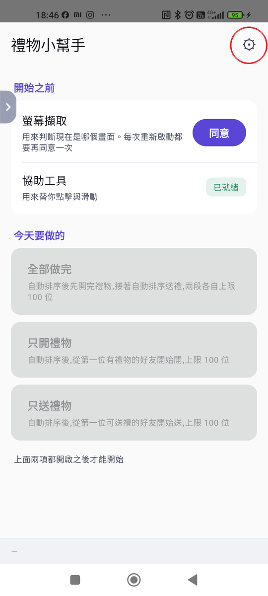

打開 App 看到的第一個畫面。幾個看不出來是什麼的地方,先講在這裡:

- **右上角那顆齒輪形狀的小圖示⚙️(上圖紅圈處)** ——這是「設定」的入口,後面所有「進設定調整 XX」的步驟,都是先點這顆齒輪。它平常不會寫「設定」兩個字,只有這個圖示。
- 中間「螢幕擷取」「協助工具」兩塊,是使用前必須先打勾的兩個開關,下面「第一次設定」會一步步講。
- 下面三個灰色長方塊(全部做完 / 只開禮物 / 只送禮物)是主要功能,要等上面兩個開關都亮綠燈之後才按得下去。

---

## 需求

- Android **12(API 31)以上**
- 已安裝 Pokémon GO,並登入好帳號
- 手機廠商的客製系統(小米 HyperOS / MIUI、OPPO、Vivo 等)通常會多一道「允許受限制的設定」關卡,下面第一次設定會特別說明

---

## 下載與安裝

👉 **[點我下載 PG_AutoGift-v0.6.apk](https://github.com/Jerry2-Yao/PG_AutoGift-Download/releases/download/v0.6/PG_AutoGift-v0.6.apk)**

點上面這個連結就會直接開始下載安裝檔,不用再進 Releases 頁面自己挑檔案。

> 如果你是自己跑去 [Releases 頁面](https://github.com/Jerry2-Yao/PG_AutoGift-Download/releases) 找檔案:請點檔名是 `.apk` 的那個,**不要點「Source code (zip)」或「(tar.gz)」**——那兩個是 GitHub 自動附加的原始碼壓縮檔,不是安裝檔,裝不起來。

安裝步驟:

1. 用手機瀏覽器打開上面的連結,下載完成後點開檔案準備安裝
2. 瀏覽器可能先跳出「這類檔案可能有害」的警告——這是因為 APK 不是從 Google Play 下載的,屬於正常現象,點「仍要下載」/「繼續」即可
3. 安裝時系統可能擋下並顯示「不允許安裝不明來源」/「未經驗證的應用程式」:點畫面上的「設定」,找到「允許此來源的應用程式」(通常來源是「Chrome」或「檔案」App)打開,回上一頁重新點一次 APK 完成安裝
4. 如果跳出「Play 保護機制」掃描警告,選「仍要安裝」/「略過檢查」即可(因為它不是 Play 商店的 App,並非真的偵測到問題)
5. 安裝完成,桌面會出現一個叫**「禮物小幫手」**的 App

---

## 第一次設定(只需要做一次)

### 步驟一:開啟「協助工具」權限

App 要靠這個權限幫你點擊、滑動。**這是使用者必須自己手動開的權限,Android 系統規定 App 沒辦法用程式碼幫你跳出這個開關**,而且**每一支手機都要各自開一次**,不會跨裝置同步。

一般手機:

1. 開啟手機的「設定」→「協助工具」
2. 找到已安裝的應用程式清單,點進**「禮物小幫手」**
3. 打開開關

**如果你的手機是小米 / Redmi / POCO(HyperOS 或 MIUI)**,官方文件寫的路徑在這類系統上**不能用**,點進去的開關是灰的、點下去只會跳出「應用程式存取權已遭拒絕」。**訣竅是倒過來做:先把「允許受限制的設定」打開,再回頭設定協助工具**,不要照著開關被鎖住那條路線硬走。

> 下面這組截圖畫面上的 App 名稱是舊版的「PG AutoGift Phase0」,現在的正式名稱是「禮物小幫手」,圖示也換了——**但每一步的路徑完全沒變**。這是一位使用者用全新手機實測回報後修正的順序,還沒來得及用現在的正式版重拍截圖,認路徑就好,不用在意畫面上的名字對不對得起來。

<table>
<tr><td width="140">1. 進入「設定 → 無障礙設定」,往下捲會看到「下載的應用程式」,點進去</td><td>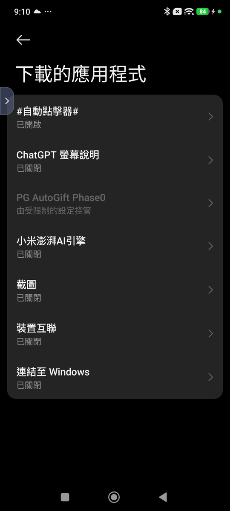</td></tr>
<tr><td>2. 找到「禮物小幫手」,點進去它的「應用程式資訊」頁</td><td>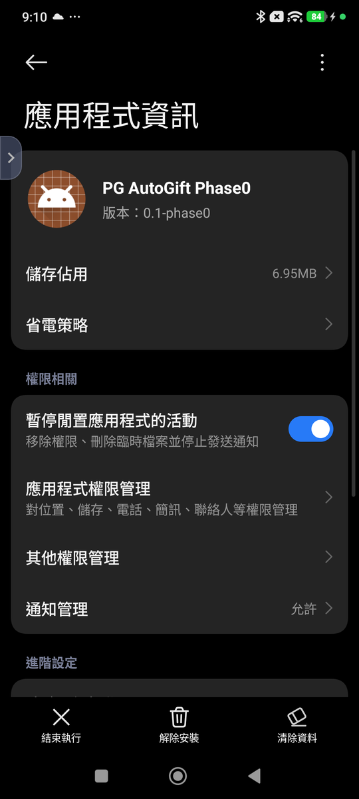</td></tr>
<tr><td>3. <b>先不要碰無障礙設定裡的開關</b>,直接往下捲到「應用程式資訊」頁最底部的「進階設定」,打開「<b>允許受限制的設定</b>」</td><td>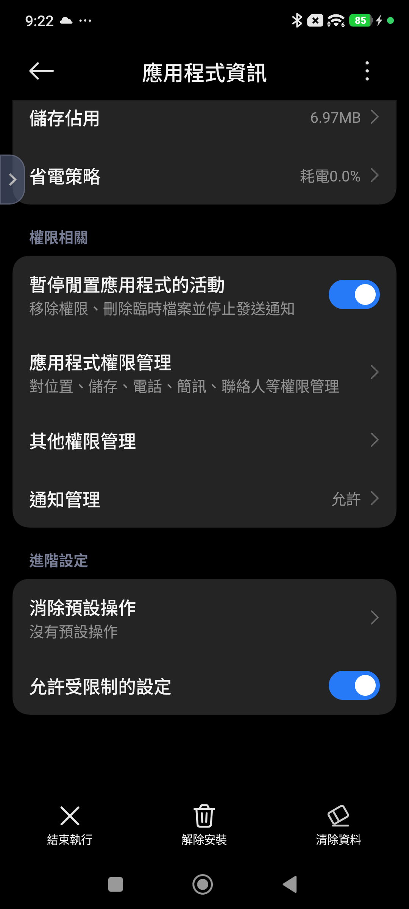</td></tr>
<tr><td>4. 回到無障礙設定,現在「禮物小幫手」的開關可以點了,打開「使用『禮物小幫手』」</td><td>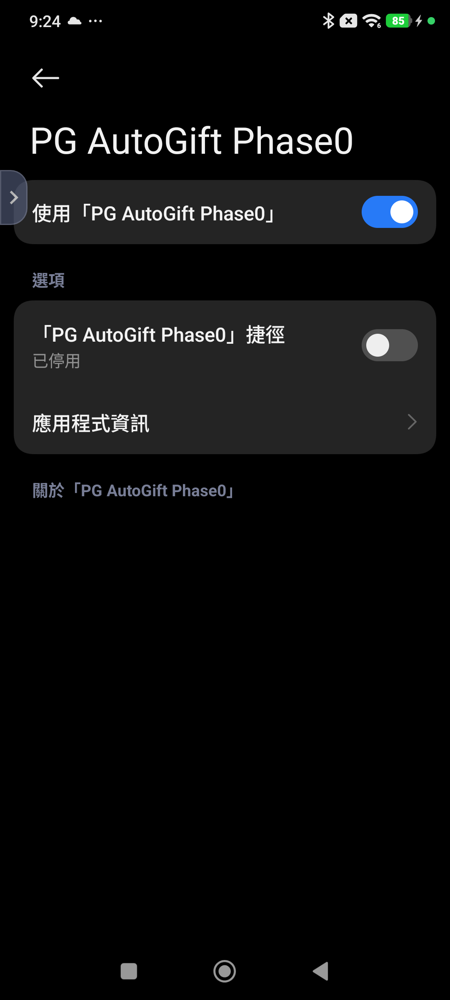</td></tr>
</table>

**如果第 3 步捲到底沒看到「允許受限制的設定」這個選項**:回上一頁(無障礙設定),點一次灰色的「禮物小幫手」,會跳出「應用程式存取權已遭拒絕」的提示——這一步的作用就是解鎖那個選項,不是失敗:

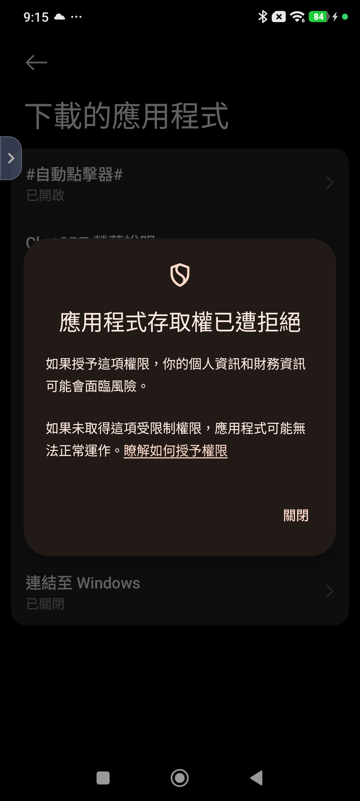

點過一次之後,回「應用程式資訊」頁再捲一次「進階設定」,選項就會出現,接著照第 3、4 步繼續。

**第 4 步打開開關之後,系統會跳出一個確認視窗**,說明這個服務可以做什麼(讀取畫面內容、代替你點擊等)。這個視窗在不同手機上長得不太一樣,共通點是:

- 小米/紅米這類手機標題會寫「**危險**」,底下有一個「**我已知曉可能存在的風險…**」的核取方塊,**要先勾起來**,底下的「確定」才能按。
- 按鈕(「允許」或「確定」)一開始是灰的,**會倒數幾秒才能點**——這是 Android 防誤按的機制,不是卡住,等按鈕變深色就能按。

### 步驟二:開啟 App,同意螢幕擷取

打開「禮物小幫手」,按「同意」畫面上會出現的螢幕錄製 / 投放內容授權,按「立即開始」。

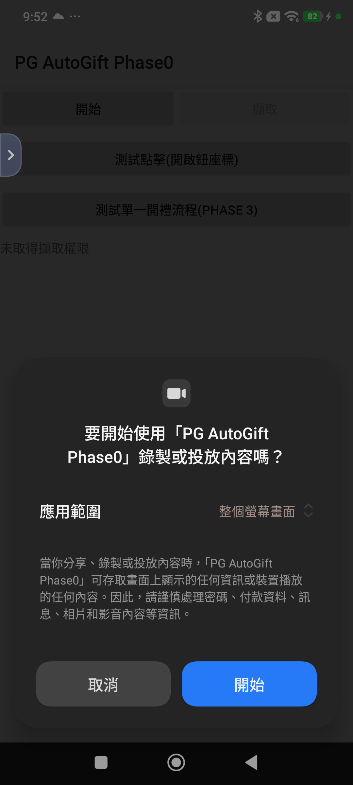

> 較新的 Android(14 以上)這個視窗會多一個「應用範圍」的選單,選「**整個螢幕畫面**」;Android 12/13 沒有這個選單,直接按「立即開始」就好。

**這個同意每次重新啟動 App 都要再按一次**,是 Android 系統的規定,不是 bug。

同意完後,首頁的「螢幕擷取」與「協助工具」兩項都要顯示綠色「已就緒」,才能繼續下一步。

---

## 開始使用

1. 打開 Pokémon GO,站到**好友列表**畫面(不是地圖、不是自己的寶可夢頁)
2. 切回「禮物小幫手」,按下「只開禮物」「只送禮物」或「全部做完」其中一顆
3. 畫面上會出現一顆綠色的懸浮圓鈕,浮在最上層——切回 Pokémon GO,**按那顆懸浮鈕才會真的開始跑**
4. 開始跑之後懸浮鈕會變成紅色「■」,隨時按它就能立刻停止
5. 跑完(或中途停止)之後,回到「禮物小幫手」的首頁,會看到「懸浮鈕顯示中」那一區,按「收起」把它收掉——不收的話它會一直留在畫面上

> **第一次按下懸浮鈕時,App 會先停 1~3 秒自己校準這台手機的畫面位置**(狀態列會閃一句「已為這台手機校準畫面位置」),然後才開始跑。這是自動的,不用你做任何事。
>
> 如果這時跳出「請先在 Pokémon GO 切到好友列表,再按一次開始鈕」——代表你當下不在好友列表,切過去再按一次懸浮鈕就好。

**每一步都會自我檢查目前是不是在正確的畫面**,認錯畫面或卡住都會停下來並存一張截圖(在手機的 `Android/data/com.jerry.pgautogift.app/files/` 資料夾裡),不會亂點。

---

## 如果在你的手機上跑不順

v0.6 起,第一次按開始時 App 會自己校準畫面位置(見上面「開始使用」的說明),**大部分手機到這裡就正常了,下面整段都不用看**。

只有在**自動校準之後還是跑不順**——點擊位置偏掉、或明明在對的畫面卻認不出來——才需要往下看。這個工具原本只在兩台手機(Mi 10T Pro、POCO F5)上實測過,少數機型的螢幕比例差太多,自動校準補不回來。

### 先按這個:重新校準一次

**設定 → 開發工具 →(捲到最底)「重新偵測畫面位置」**——清掉上次的校準值,下次按「只開禮物」等會重新掃一次。多數「跑一跑突然歪掉」按這個就好。

### 還是不行:分清楚是哪一種問題

**每次自動點擊,畫面上都會在點下去的實際位置閃一下紅點**(設定裡預設開啟,不想要可以關掉)。跑起來的時候盯著手機看:

- **紅點閃的位置明顯不在按鈕上**(例如閃在畫面空白處、或別的按鈕上)→ 這是**「點錯位置」**,按鈕的座標跟你手機上實際的按鈕對不齊。去下面「校正」調整。
- **紅點閃的位置看起來是對的**,但畫面卻沒有反應、卡住不動 → 比較可能是**「認錯畫面」**,App 判斷現在該點這裡,但其實根本站錯了畫面。去下面「畫面辨識」重新學習。

**每次自動點擊,畫面上都會在點下去的實際位置閃一下紅點**(設定裡預設開啟,不想要可以關掉)。跑起來的時候盯著手機看:

- **紅點閃的位置明顯不在按鈕上**(例如閃在畫面空白處、或別的按鈕上)→ 這是**「點錯位置」**,按鈕的座標跟你手機上實際的按鈕對不齊。去下面「校正」調整。
- **紅點閃的位置看起來是對的**,但畫面卻沒有反應、卡住不動 → 比較可能是**「認錯畫面」**,App 判斷現在該點這裡,但其實根本站錯了畫面。去下面「畫面辨識」重新學習。

如果沒盯著看、事後才發現卡住了:App **每次卡住都會自動存一張當下的畫面截圖**,存在手機的 `Android/data/com.jerry.pgautogift.app/files/` 資料夾,檔名會標記卡在哪一步(例如 `loop_stop_after3friends`)。截圖裡看不到剛才那個紅點(紅點只在點擊當下閃 0.4 秒,不會被存進截圖),但可以看「畫面本身對不對」——跟預期完全不同就是認錯畫面,看起來對但卡住就是點錯位置,判斷方式跟上面一樣。

### 畫面辨識(解決「認錯畫面」)

進「設定 → 畫面辨識」,裡面列著五個 App 需要認得的畫面。**站在 Pokémon GO 對應的那個畫面上**,按進那一列、切到 PoGo、按懸浮鈕,約 20 秒就會存好這台手機自己的版本,不需要你畫框或輸入任何數字。

> v0.6 起這一步大多用不到——自動校準會處理掉。真的要用的話,把五個畫面都各學一次比較保險。

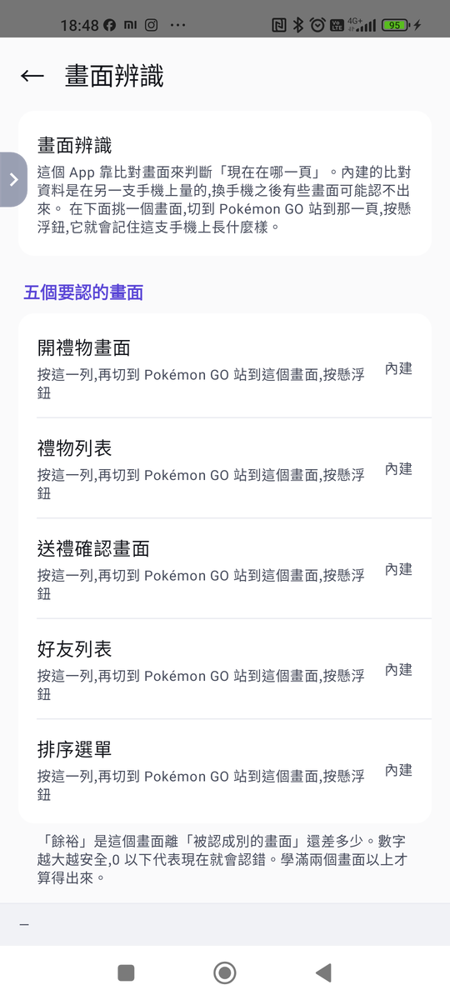

這五個名詞不是每個人都望文生義——尤其「排序選單」,沒特別去點過右下角那個排序鈕根本不知道長怎樣。下面把五個名詞對照到 Pokémon GO 實際畫面(帳號、好友、送禮明信片上的個人/地點資訊都已打碼):

<table>
<tr><td width="140"><b>好友列表</b> 點底部「朋友」分頁看到的那一整頁清單</td><td></td></tr>
<tr><td><b>排序選單</b> 在好友列表按右下角的排序圖示彈出來的選單(最近/名稱/友情禮物…等選項)</td><td>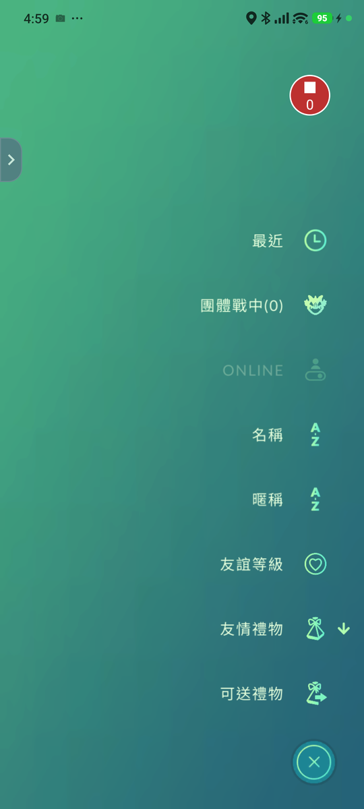</td></tr>
<tr><td><b>禮物列表</b> 在某位好友頁按「傳送友情禮物」後,問你要送哪一個的畫面</td><td>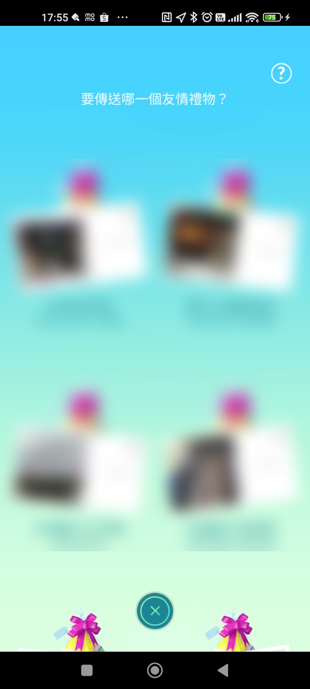</td></tr>
<tr><td><b>開禮物畫面</b> 好友送你禮物、你點開之後,還沒按「開啟」之前的畫面</td><td>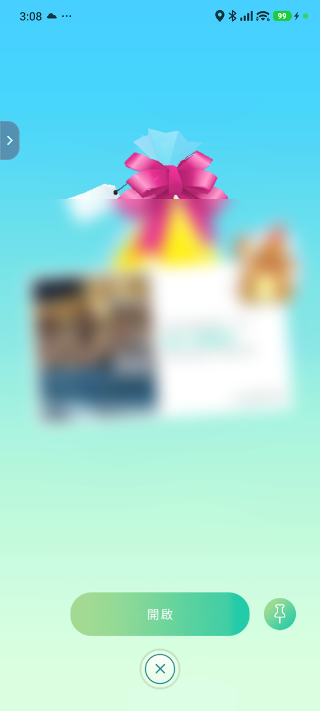</td></tr>
<tr><td><b>送禮確認畫面</b> 在禮物列表選了一份禮物後,按「傳送」之前的最後確認畫面</td><td>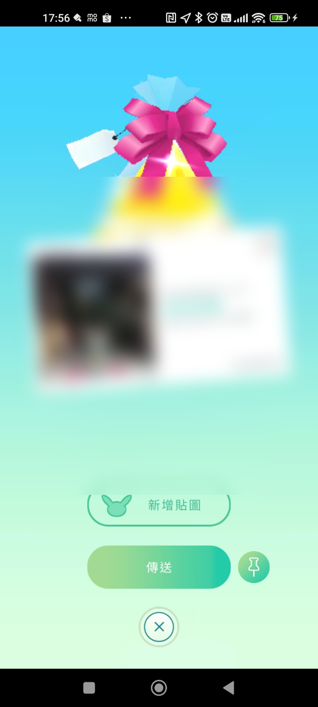</td></tr>
</table>

上圖是還沒重學過、全部用內建設定的樣子。重學完之後,這一行文字會改成「已為這台手機重學 N 個畫面」:

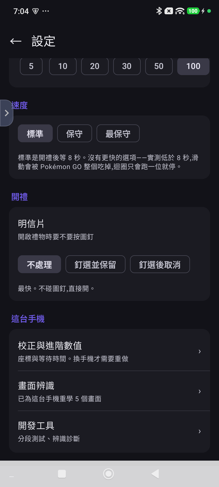

### 校正與進階數值(解決「點錯位置」)

進「設定 → 校正與進階數值」,裡面是各個按鈕座標(用 0~1 的比例表示,不是像素)與等待時間。看上一步閃的紅點偏了多少、往哪個方向偏,照比例調整對應的座標數字。

如果想要更精確地對準,「設定 → 開發工具 → 顯示校正紅點」提供另一種**可拖曳**的紅點,固定對準「開啟」鈕的座標——切到 Pokémon GO 的開禮物畫面,比對紅點跟真正的按鈕差多少,拖曳到正確位置放開就會直接存檔,不用自己換算比例:

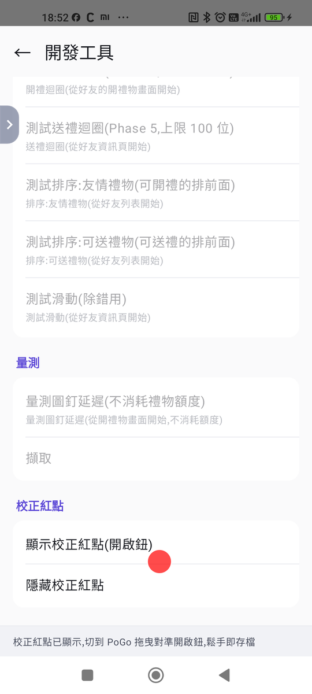

**這顆可拖曳的紅點目前只做得到「開啟」鈕**,其餘按鈕(送禮的傳送鈕、排序選單選項等)沒有拖曳比對的功能,只能對照跑起來時閃的紅點或存檔截圖,自己目測調整校正頁的數值。

如果調過還是不順,大概率是版面差異太大,這個工具目前就是做不到——不是你操作錯。

### 特別狀況:Pokémon GO 有沒有「吃掉」系統列

**這是 POCO F5 這類機型特別會踩到的問題**,值得單獨講清楚。Pokémon GO 在不同手機上,畫面佔螢幕的範圍不一樣:

| | 畫面範圍 | 對照範例 |
|---|---|---|
| **不吃系統列**(多數手機) | 遊戲上下都讓出黑色系統列(時間、電量在黑底上),遊戲內容只佔中間一段 | Mi 10T Pro |
| **吃掉系統列**(部分機型,含 POCO F5) | 遊戲畫滿整個螢幕,時間、電量直接疊在遊戲畫面上,底部也沒有黑邊 | POCO F5 |

實際對照(兩張都截自遊戲地圖畫面,帳號資訊已打碼):

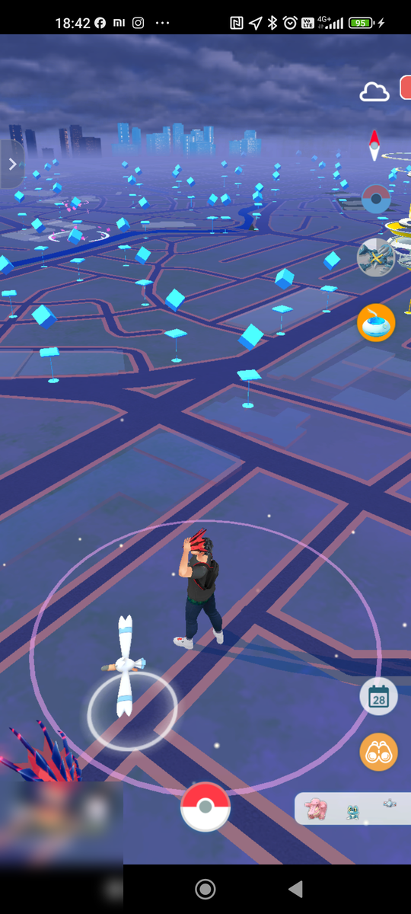 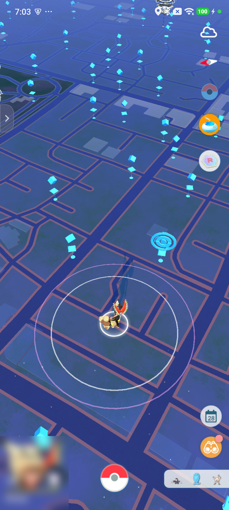

**這不是手機裡可以找到的系統設定**——我們實際翻過兩台手機的「顯示設定」,都沒有一個叫「全螢幕」「沉浸式」的開關可以切。這純粹是手機廠牌/型號讓 Pokémon GO 自己決定要不要畫到系統列底下,使用者管不到。

真正要做的,是照你自己手機的實際樣子,告訴 App 是哪一種。進「設定 → 校正與進階數值」,找到「**遊戲全螢幕沉浸模式**」這個核取方塊:

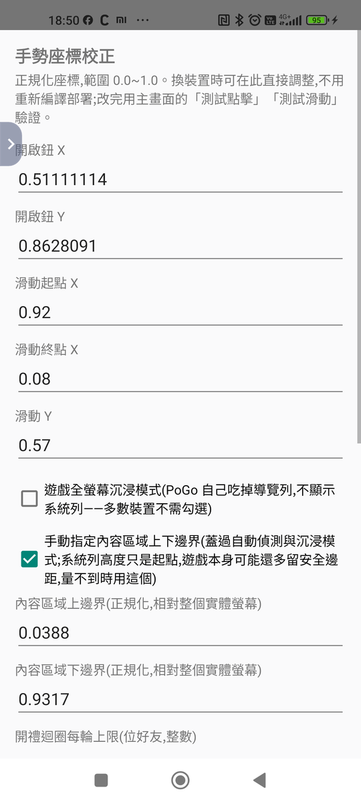 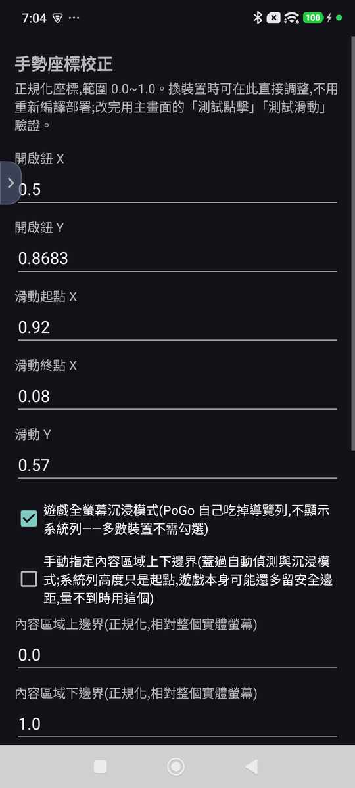 

- 你的手機跟上面「不吃系統列」那張比較像 → **不要勾**(多數裝置)
- 跟「吃掉系統列」那張比較像 → **要勾選**

勾錯的症狀通常是:App 判斷的按鈕位置整體往上或往下偏移一截,調座標怎麼調都對不齊——先檢查這個勾選對不對,再去調個別按鈕的座標。

---

## 使用建議:先關掉這兩個 Pokémon GO 功能

強烈建議在使用這個工具期間,**暫時關掉 Pokémon GO 的「自動捕捉」與「自動轉補給站」**。這兩個功能會在畫面上跳出任務進度橫幅、捕獲提示等突發訊息,可能剛好蓋住 App 用來判斷目前是哪個畫面的取樣區域,讓 App 誤判成「認不出畫面」而中途停止——這不是臆測,是分析一週的實機記錄後找到的最常見中斷原因之一。跑完這個工具之後要抓寶可夢、轉補給站,再打開就好。

---

## 已知限制 / 常見問題

- **不要對這個 App 使用「強制停止」。** 會連帶關掉「協助工具」的授權,下次要重新走一次步驟一;一般的關閉 App、重新整理不會有這個問題。
- 如果首頁「協助工具」那格沒有顯示綠色「已就緒」(即使開關看起來是開的),到「設定 → 無障礙 →『使用禮物小幫手』」把開關**關掉再開一次**。
- App 被系統殺背景或重開手機後,「協助工具」權限通常還在,但「螢幕擷取」同意一定要重新按。
- 這工具**不保證每天用都不會被抓**——伺服器端看的是長期規律,用得越規律、越長時間,風險越高。
- 沒有自動更新機制,新版本一樣是回這個頁面重新下載安裝。首頁標題下面會顯示目前版本(例如 `v0.6`),回報問題時附上這個。
- **v0.5 有一個一按功能就閃退的錯誤,v0.6 已修。** 用 v0.5 的請務必更新。

---

## 意見回饋與功能許願

用起來覺得哪裡怪、有 bug,或是想許願新功能,都歡迎跟把連結給你的那個人(開發者)反應。先說在前面:**不保證會照著大家的意見修改**,採不採用、什麼時候做,都是開發者自己判斷。

許願功能沒問題,但**下面這幾類請不要許願**,因為專案一開始就刻意排除,不是還沒空做,問了也不會有:

- GPS 偽造 / 搖桿移動位置
- 自動打道館、自動對戰
- Root、隱藏 Hook、偽造 Play Integrity/SafetyNet 之類繞過官方偵測機制的東西

---

## 免責聲明

本工具僅供技術研究與朋友之間小範圍測試交流,不提供任何形式的保固或客服支援。因使用本工具導致的任何帳號問題(包含但不限於警告、停權、封禁),使用者需自行承擔全部後果,與作者無關。請先評估風險再決定是否使用。
